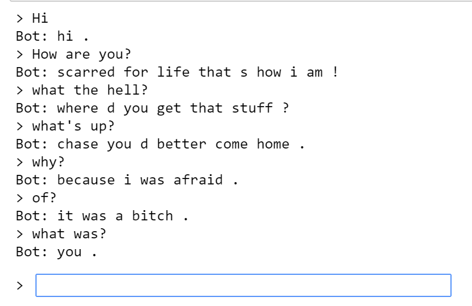

# Chatbot
## Introduction

The	Turing	test	is	a	test	of	a	computer’s	ability	to	display	intelligent	behavior equivalent	to	that	of	a	human.	Alan	Turing	introduced	the	test in	his	1950	paper	 “Computing	Machinery	and	Intelligence”.	Even	though	the	test	has	existed	for	over	60	years,	no	program	has	been	able	to	pass	it; though	some	have	been	close.	

A	chatbot	is	a	computer	program	that	engages	in	written or	spoken	conversation	with	a	human	user.	For	the	developer,	the	goal	is	to	make	the	chatbot	as	intelligent	as	possible	and	to	pass	the	Turing	test.	In	1966	Joseph	Weizenbaum	created	a	chatbot called	ELIZA.	It	mimicked	the	responses	of	a	psychotherapist	and	came	very	close	to	passing	the	Turing	test.

Conversational models are a hot topic in artificial intelligence research. Chatbots now can be found in a variety of settings, including customer service applications and online helpdesks. These bots are often powered by retrieval-based models, which output predefined responses to questions of certain forms. In a highly restricted domain like a company’s IT helpdesk, these models may be sufficient, however, they are not robust enough for more general use-cases. Teaching a machine to carry out a meaningful conversation with a human in multiple domains is a research question that is far from solved. Recently, the deep learning boom has allowed for powerful generative models like Google’s Neural Conversational Model, which marks a large step towards multi-domain generative conversational models. In this project, we will implement this kind of model in PyTorch.

## Results

